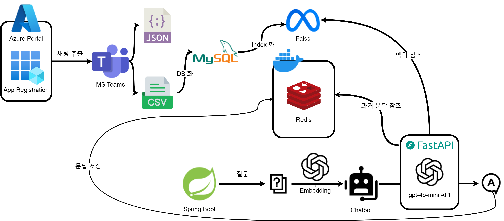

# **Microsoft Teams 채팅 데이터 추출기**  
---

---
## 🚀 **챗봇 구현**
### ✅ **1. CSV 데이터를 기반으로 데이터베이스 구축 및 웹 애플리케이션 개발**
- **Spring Boot**를 활용하여 웹 애플리케이션을 개발하였으며, 데이터베이스의 채팅 데이터를 웹에서 조회할 수 있도록 구현하였습니다.
- 추출한 csv 파일을 통해 데이터베이스를 사전 구축하여야 합니다.

### ✅ **2. FastAPI를 활용한 챗봇 시스템 구현**
- **FastAPI**를 이용하여 **OpenAI API**를 호출하고, 이를 기반으로 챗봇을 구현하였습니다.

### ✅ **3. FAISS를 활용한 RAG (Retrieval-Augmented Generation) 적용**
- 챗봇이 **채팅 내용을 기반으로 답변을 생성**합니다.

### ✅ **4. Redis를 활용한 세션 기반 대화 기억 기능 추가**
- **사용자와의 이전 문답을 기억하도록 하여 맥락을 고려한 대화를 가능케 했습니다.**

---

- 이 프로젝트는 **Microsoft Teams**의 채팅 데이터를 API를 활용하여 가져오고 저장하는 Python 기반 Jupyter Notebook입니다.  
- 기업 계정에서는 **MS Teams 채팅 내보내기 기능이 제한**되므로, **Microsoft Graph API**를 활용하여 데이터를 가져오는 방법을 구현했습니다.  

---

## 📌 **1. Azure에서 애플리케이션 등록 및 API 설정**  
### **🔹 1) Azure Portal에서 애플리케이션 등록**  
1. [Azure Portal](https://portal.azure.com/)에 로그인  
2. **Microsoft Entra ID (구 Azure AD)** 로 이동  
3. **앱 등록 (App registrations)** 클릭  
4. 다음 정보를 입력하고 애플리케이션을 등록  
   - **이름:** `(예시) Teams Chat Exporter`  
   - **지원되는 계정 유형:** 조직 디렉터리에서만 (Single Tenant)  
   - **리디렉션 URI:** `http://localhost:5000/callback`  
5. 등록 완료 후 **애플리케이션(클라이언트) ID** 및 **디렉터리(테넌트) ID**를 확인  

### **🔹 2) API 권한 추가**  
1. **Azure Portal** → **앱 등록** → `Teams Chat Exporter` 앱 선택  
2. **API 권한** → **권한 추가** 클릭  
3. **Microsoft Graph** → **위임된 권한 (Delegated permissions)** 선택  
4. 다음 권한 추가 후, **관리자 동의 요청** 진행:  
   - `User.Read` (사용자 정보 조회)  
   - `Chat.Read` (채팅 메시지 읽기)  
5. 저장 후 **관리자 동의 버튼 클릭**  

### **🔹 3) 클라이언트 시크릿 생성**  
1. **Azure Portal** → **앱 등록** → `Teams Chat Exporter` 앱 선택  
2. **인증서 및 비밀 (Certificates & Secrets)** → **새로운 클라이언트 시크릿 추가**  
3. 설명 입력 (`Teams Chat Secret` 등) 후 **만료 기간 선택 (최대 가능 기간 추천)**  
4. 생성된 **시크릿 값**을 복사하여 보관 (다시 확인 불가!)  

✅ **이제 `config.txt`에 위 정보를 저장하여 사용할 수 있습니다.**  

---

## 📌 **2. 환경 설정 (config.txt 생성 방법)**  
이 프로젝트에서는 API 키와 인증 정보를 `config.txt` 파일에 저장하여 관리합니다.  

### **🔹 1) `config.txt` 파일 생성**  
📜 **프로젝트 폴더에 `config.txt` 파일을 생성하고, 아래 내용을 입력하세요.**  
```txt
TENANT_ID=your_tenant_id
CLIENT_ID=your_client_id
CLIENT_SECRET=your_client_secret
REDIRECT_URI=http://localhost:5000/callback
```
⚠ **보안 주의!**  
- 이 파일은 절대 공개 저장소(GitHub 등)에 업로드하지 마세요.  
- `.gitignore`에 `config.txt`를 추가하여 업로드를 방지하세요.  

### **🔹 2) `config.txt`를 Python에서 불러오기**  
프로젝트에서 `config.txt` 파일을 읽고, 환경 변수를 설정하는 코드입니다.  
```python
import os

# 환경 변수 저장 딕셔너리
config = {}

# config.txt 파일 읽기
config_file_path = "config.txt"
with open(config_file_path, "r", encoding="utf-8") as f:
    for line in f:
        key, value = line.strip().split("=", 1)
        config[key] = value.strip()

# 환경 변수에 설정
os.environ.update(config)

# 환경 변수 사용 예시
TENANT_ID = os.getenv("TENANT_ID")
CLIENT_ID = os.getenv("CLIENT_ID")
CLIENT_SECRET = os.getenv("CLIENT_SECRET")
REDIRECT_URI = os.getenv("REDIRECT_URI")

print("✅ 환경 변수 설정 완료")
```

---

## 📌 **3. 실행 방법**  
### **🔹 1) Jupyter Notebook에서 실행**  
1. Jupyter Notebook을 실행한 후, `ms_teams_save_chatting_via_api.ipynb` 파일을 엽니다.  
2. **모든 셀을 순서대로 실행**하면 채팅 데이터를 JSON 및 CSV 형식으로 저장할 수 있습니다.  
3. 저장된 파일은 바탕화면 (`Desktop`)에 자동으로 생성됩니다.  

### **🔹 2) 실행 후 저장되는 파일**  
- 📜 `chat_data.json` → **전체 채팅 데이터 (JSON 형식)**  
- 📜 `chat_data.csv` → **엑셀에서 열 수 있는 CSV 파일 (UTF-8-SIG 인코딩 적용)**  

✅ **한글이 깨지지 않도록 `utf-8-sig` 인코딩이 적용되었습니다.**  

---

## 📌 **4. 기능 요약**  
✅ **1:1 채팅방의 모든 메시지 기록을 가져옴**  
✅ **Flask 기반 OAuth 2.0 인증 후 `access_token`을 `token.txt`에 저장**  
✅ **페이지네이션 (`@odata.nextLink`)을 활용하여 모든 채팅 데이터를 수집**  
✅ **JSON 및 CSV 파일로 저장 (엑셀에서 한글 깨짐 없음)**  
✅ **Flask 실행 후 인증 완료 시 자동 종료 (수동 종료 불필요)**  

---

## 📌 **5. 자주 묻는 질문 (FAQ)**  
### **Q1. `token.txt`가 없으면 어떻게 되나요?**  
A: `token.txt`가 없으면 API 요청이 실패합니다.  
👉 먼저 **OAuth 2.0 인증 (`flask_server.py`)을 실행하여 `token.txt`를 생성하세요.**  

### **Q2. API 요청 시 `"InvalidAuthenticationToken"` 오류가 발생합니다.**  
A: `access_token`이 올바르게 설정되지 않았거나 만료되었습니다.  
👉 **다시 `flask_server.py`를 실행하여 새로운 `access_token`을 받아야 합니다.**  

### **Q3. 채팅 데이터 저장 시 한글이 깨집니다.**  
A: CSV 파일 저장 시 **엑셀에서 `UTF-8` 인코딩을 적용**해야 합니다.  
👉 `utf-8-sig`를 적용한 `chat_data.csv` 파일을 엑셀에서 열어보세요.  
